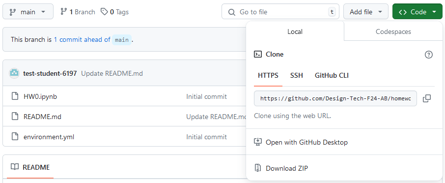
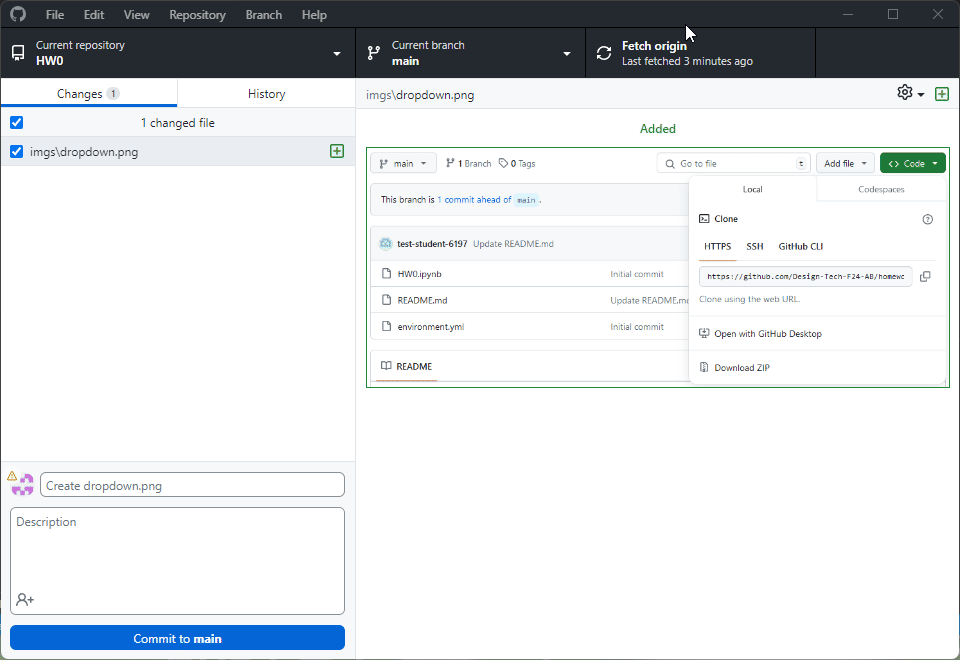

Welcome to homework 3. Again, you will need to clone this repo to your local machine. I have copied the instructions here for ease of access.

>[!NOTE]
>When you create the environment with mamba for this assignment you need to ensure that you install the correct version for your computer. There is one environment_default.yml file for Mac computers and windows machines that do not have nvidia gpus. There is also an environment_win.yml for windows computers with compatible Nvidia GPUs. If you do not have a compatible gpu then training a network on your personal computer may take considerably more time. In this case I would recommend you use google colab to complete the assignment. Please contact me individually for help completing the assignment using google colab as the instructions for setting up the homework assignment will be different than those listed below. 

 There will be instructions below for you to follow to set up your environment correctly.

### Step 1: Clone the repository

Once you are in the repository, you should see a green button that says "Code". Click on that button and you should see a URL. Copy that URL using the copy button.

It should look like this:

Now go and open github desktop. Go to file -> clone repository. Make sure you are on the 'URL' tab and paste the URL you copied into the 'Repository URL' box. Choose a location on your computer where you want to save the repository and click 'Clone'. Generally you can just leave the path as it is, unless you have some specific reason to change it. 

Now you should see the repository in your github desktop. If you get a popup, you can just accept whichever option makes the most sense for you.

Finally you can click the button that says 'Open in Visual Studio Code' to open the repository in your code editor.

The process should look like this:

### Step 2: Set up your environment

In VS Code, open the terminal by going to Terminal -> New Terminal. You should see a terminal open at the bottom of your screen. This step is the one that is different from HW0 and will depend on which operating system you use.

In the terminal on windows with a CUDA 11.8 compatible GPU, type the following command:

`mamba env create -f environment_win.yml`

If you do not have a CUDA 11.8 compatible GPU use the same command that the mac uses, or contact me to learn how to complete the homework using [Google Colab](https://colab.research.google.com/).

In the terminal on mac (or non-CUDA 11.8 compatible GPU), type the following command:

`mamba env create -f environment_default.yml`

and then press enter. This will create a new environment called 'DESIGN-6197-4197-HW2' install the necessary packages. 

Once the environment is done installing, you should see some instructions on how to activate the environment. You can ignore this and just close out of the terminal window. 

>[!NOTE]
>For each homework I am having you download a lot of packages. This is the simplest way to ensure that the environments will run without conflicts, however some of these packages (e.g. pytorch) can be quite large. If you have lots of space on your hard drive then downloading multiple copies of these packages is not a problem. If you are finding that these packages are causing you to run low on hard drive space then you can remove environments for earlier homework assignments. 
>
>To do this, the easiest way is to open up the Miniforge Prompt application on your computer. Then you can type `mamba env remove -n DESIGN-6197-4197` which should remove the environment you created for HW0. Similarly, you can do the same thing for the environment from HW1, but you will need to replace the name in the command with the name of the environment for HW1. 

### Step 3: Open the notebook

In the file explorer on the left side of the screen there will be a file called HW2.ipynb. Click on this file to open it. You should see the notebook open in a new tab. 

At the top right-hand side of the tab you should see a button that says 'Select Kernel'. A kernel is basically the environment that the notebook runs in. You should see another menu pop up. It may say 'Select a Kernel Source', you should select the python one. Then select the environment that is called 'DESIGN-6197-4197-HW2'. If you are on a Mac, you may need to restart vs code before this environment will appear after running the `mamba env create` command.

Now you should be all set up and ready to go! You can begin following the instructions in the notebook to complete the rest of the assignment.

